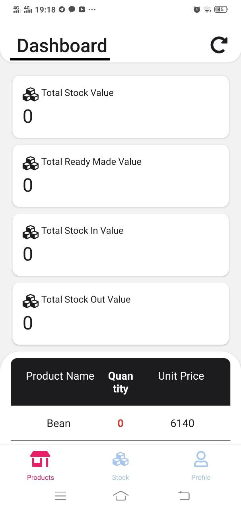
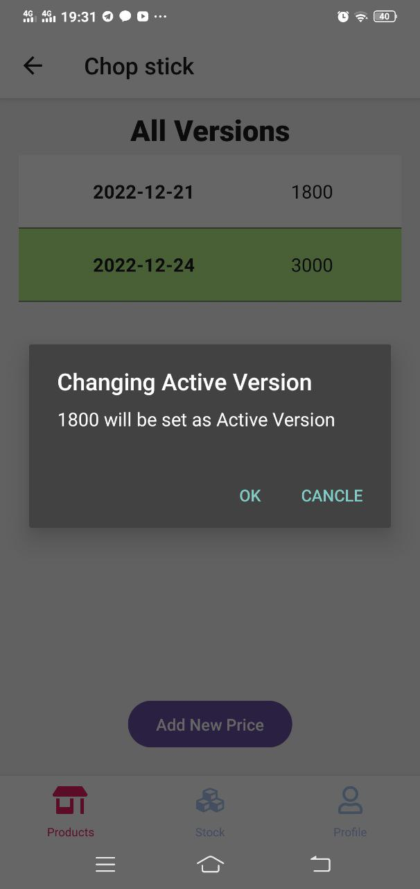

# Welcome to Aye Noodle Stock Management

Functions of this project as following:

- Stock In and Out Form
- Authentication form
- Error Handling
- Dashboard
- Display list
- adding different versions and change between versions
- Multi language support
- Offline Support

### App Design Interface

<table>
<tr>
<td colspan=2 align="center"> </td>
<td> </td>
</tr>
<tr>
<td> </td>
<td> </td>
<td> </td>
</tr>
<tr>
<td> </td>
<td> </td>
<td> </td>
</tr>
<tr>
<td> </td>
<td> </td>
<td> </td>
</tr>
<tr>
<td> </td>
<td> </td>
<td> </td>
</tr>

</table>
### Tech Stack

- Node.js
- AWS EC2 / RDS
- React Native
- Sequelize ORM
- MySQL
- JWT
- Redux
